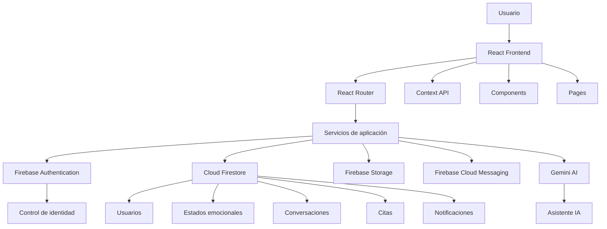
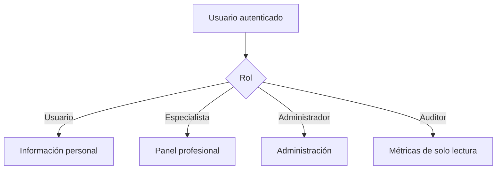

# FeelSafe

### Sistema Inteligente para el Bienestar Emocional

<p align="center">

**FeelSafe** es una plataforma web inteligente orientada al monitoreo, prevención y acompañamiento del bienestar emocional mediante **Inteligencia Artificial, análisis de emociones y comunicación con especialistas**.

<br>


\

</p>

---

## 📑 Índice

* [Descripción](#-descripción)
* [Problema que aborda](#-problema-que-aborda)
* [Objetivo general](#-objetivo-general)
* [Objetivos específicos](#-objetivos-específicos)
* [Características principales](#-características-principales)
* [Arquitectura del sistema](#-arquitectura-del-sistema)
* [Módulo de usuarios](#-módulo-de-usuarios)
* [Módulo de especialistas](#-módulo-de-especialistas)
* [Roles y permisos](#-roles-y-permisos)
* [Tecnologías](#-tecnologías)
* [Estructura del proyecto](#-estructura-del-proyecto)
* [Flujo de funcionamiento](#-flujo-de-funcionamiento)
* [Firebase](#-integración-con-firebase)
* [Gemini AI](#-integración-con-gemini-ai)
* [Seguridad](#-seguridad)
* [Variables de entorno](#-variables-de-entorno)
* [Requisitos](#-requisitos)
* [Instalación](#-instalación)
* [Ejecución](#-ejecución)
* [Build de producción](#-build-de-producción)
* [Despliegue](#-despliegue)
* [Estado del proyecto](#-estado-del-proyecto)
* [Equipo](#-equipo)
* [Licencia](#-licencia)

---

# 🎯 Descripción

**FeelSafe** es una plataforma web desarrollada para promover el **bienestar emocional** mediante herramientas digitales de seguimiento, análisis, orientación y comunicación.

La aplicación combina una arquitectura moderna basada en **React + Firebase** con servicios de **Inteligencia Artificial mediante Google Gemini**, permitiendo construir una experiencia personalizada para cada usuario.

El sistema integra:

* 📊 Seguimiento del estado emocional.
* 🤖 Asistente conversacional basado en IA.
* 📈 Estadísticas y métricas de bienestar.
* 🧘 Recursos educativos y ejercicios.
* 🧑‍⚕️ Comunicación con especialistas.
* 📅 Gestión de citas.
* 🆘 Centro SOS.
* 🔐 Autenticación y control de acceso.
* 🌙 Modo claro y oscuro.
* 🌎 Soporte multiidioma.
* 🔔 Sistema de notificaciones.

> **Importante:** FeelSafe es una herramienta tecnológica de acompañamiento y prevención. No sustituye una evaluación, diagnóstico o tratamiento profesional.


# 🚀 Características principales

| Módulo              | Funcionalidad                      | Estado |
| ------------------- | ---------------------------------- | ------ |
| 🔐 Autenticación    | Email / Google / Facebook          | ✅      |
| ✉️ Verificación     | Verificación de correo electrónico | ✅      |
| 📊 Dashboard        | Métricas y resumen emocional       | ✅      |
| 😊 Mood Tracker     | Registro de emociones              | ✅      |
| 🤖 IA               | Chatbot con Gemini                 | ✅      |
| 🧑‍⚕️ Especialistas | Comunicación usuario-especialista  | ✅      |
| 💬 Chat             | Mensajería en tiempo real          | ✅      |
| 📅 Citas            | Gestión de sesiones                | ✅      |
| 🆘 SOS              | Acceso rápido a redes de apoyo     | ✅      |
| 📚 Recursos         | Material educativo                 | ✅      |
| 👤 Perfil           | Gestión de información personal    | ✅      |
| 🖼️ Avatar          | Cambio de fotografía               | ✅      |
| 🌙 Tema             | Claro / oscuro                     | ✅      |
| 🌎 Idioma           | Sistema multiidioma                | ✅      |
| 🔔 Notificaciones   | Notificaciones del sistema         | ✅      |
| 📈 Estadísticas     | Análisis del estado emocional      | ✅      |

---

# 🏗️ Arquitectura del sistema

FeelSafe utiliza una arquitectura modular basada en una aplicación **SPA (Single Page Application)**.



### Capas principales

**Presentación**

React, componentes reutilizables, páginas, layouts y estilos.

**Estado**

Context API para manejar información global como usuario, autenticación, tema e idioma.

**Servicios**

Capa encargada de encapsular la comunicación con Firebase y Gemini.

**Persistencia**

Cloud Firestore para información estructurada y Firebase Storage para archivos.

**Inteligencia Artificial**

Google Gemini para procesamiento conversacional.

---

# 👤 Módulo de usuarios

El módulo de usuarios está diseñado para proporcionar una experiencia personalizada.

### 🔐 Autenticación

Permite:

* Registro mediante correo electrónico.
* Inicio de sesión.
* Inicio de sesión con Google.
* Inicio de sesión con Facebook.
* Verificación de correo.
* Cierre de sesión.
* Protección de rutas privadas.

### 📊 Dashboard

El panel principal presenta información relevante como:

* Porcentaje de bienestar.
* Rachas de registro.
* Últimas emociones.
* Resumen de actividad.
* Acceso rápido a herramientas.

### 😊 Mood Tracker

Permite registrar:

* Emoción.
* Intensidad.
* Fecha.
* Notas personales.

Los registros almacenados permiten generar estadísticas y visualizar tendencias.

### 🤖 Asistente IA

El usuario puede interactuar con un asistente conversacional basado en Gemini.

El asistente está orientado a:

* Escucha inicial.
* Orientación general.
* Ejercicios de respiración.
* Técnicas de relajación.
* Recomendaciones de autocuidado.
* Orientación hacia recursos de apoyo.

### 🆘 Centro SOS

Proporciona acceso rápido a herramientas de emergencia y redes de apoyo disponibles.

### 📚 Recursos educativos

Incluye contenidos relacionados con:

* Respiración.
* Relajación.
* Autocuidado.
* Bienestar emocional.
* Manejo de emociones.


# 🧑‍⚕️ Módulo de especialistas

FeelSafe incorpora un espacio especializado para profesionales.

### Dashboard

Permite consultar información relacionada con los usuarios asignados.

### 📅 Gestión de citas

Permite gestionar sesiones y disponibilidad.

### 💬 Mensajería

Los especialistas pueden mantener conversaciones con usuarios mediante un sistema de mensajería conectado a Firestore.

La arquitectura permite actualizar conversaciones prácticamente en tiempo real mediante listeners de Firestore.

---

# 🔐 Roles y permisos

FeelSafe utiliza un modelo de **RBAC — Role Based Access Control**.



### 👤 Usuario

Puede acceder exclusivamente a sus propios datos y funcionalidades autorizadas.

### 🧑‍⚕️ Especialista

Accede a las herramientas relacionadas con la gestión de usuarios asignados, citas y conversaciones.

### 🛡️ Administrador

Dispone de permisos administrativos para gestionar la plataforma.

### 🔎 Auditor

Dispone de acceso de solo lectura a información autorizada para procesos de supervisión y control.

---

# 🛠️ Tecnologías utilizadas

## Frontend

| Tecnología    | Uso                           |
| ------------- | ----------------------------- |
| React         | Construcción de la interfaz   |
| Vite          | Desarrollo y bundling         |
| JavaScript    | Lógica de aplicación          |
| CSS3          | Diseño y responsive           |
| React Router  | Navegación                    |
| Framer Motion | Animaciones                   |
| React Icons   | Iconografía                   |
| Recharts      | Visualización de estadísticas |

## Backend / Cloud

| Tecnología               | Uso                     |
| ------------------------ | ----------------------- |
| Firebase Authentication  | Autenticación           |
| Cloud Firestore          | Base de datos NoSQL     |
| Firebase Storage         | Archivos y fotografías  |
| Firebase Cloud Messaging | Notificaciones          |
| Google Gemini AI         | Inteligencia Artificial |


# 🔄 Flujo general del sistema

sequenceDiagram

    participant U as Usuario
    participant R as React
    participant F as Firebase
    participant G as Gemini

    U->>R: Inicia sesión
    R->>F: Autenticación
    F-->>R: Usuario autenticado

    U->>R: Registra emoción
    R->>F: Guarda registro
    F-->>R: Datos almacenados

    U->>R: Solicita asistencia IA
    R->>G: Consulta
    G-->>R: Respuesta
    R-->>U: Mostrar orientación

    U->>R: Contacta especialista
    R->>F: Crear/actualizar conversación
    F-->>R: Mensaje en tiempo real
    R-->>U: Mostrar conversación
```

---

# 🔥 Integración con Firebase

Firebase funciona como infraestructura principal del sistema.

### Firebase Authentication

Gestiona:

* Identidad.
* Sesiones.
* Proveedores sociales.
* Verificación de correo.

### Cloud Firestore

Almacena información estructurada como:

```text
users
moods
conversaciones_especialistas
mensajes
citas
notificaciones
emailCodes
```

La aplicación utiliza listeners de Firestore para actualizar determinadas interfaces en tiempo real.

### Firebase Storage

Se utiliza para almacenar archivos asociados al usuario, principalmente fotografías de perfil y recursos multimedia autorizados.

### Firebase Cloud Messaging

Permite implementar notificaciones para mantener al usuario informado sobre eventos relevantes.

---

# 🤖 Integración con Gemini AI

FeelSafe utiliza **Google Gemini** como motor de Inteligencia Artificial para el asistente conversacional.

Flujo:

```text
Usuario
   ↓
Interfaz de Chat
   ↓
geminiService.js
   ↓
POST /api/gemini
   ↓
Gemini API (servidor)
   ↓
Procesamiento de solicitud
   ↓
Respuesta
   ↓
Interfaz de FeelSafe
```

La integración se encuentra encapsulada dentro de la capa `services`. La clave Gemini vive únicamente en el servidor y no debe utilizarse con el prefijo `VITE_`.

> La IA debe considerarse un mecanismo de orientación y acompañamiento general, no un sustituto de atención profesional.

---

# 🔒 Seguridad

La seguridad se implementa mediante diferentes capas.

### Autenticación

Firebase Authentication controla la identidad de los usuarios.

### Autorización

Las reglas de Firestore restringen el acceso dependiendo del usuario y sus permisos.

### Rutas protegidas

Las rutas privadas requieren autenticación y correo verificado. Las rutas profesionales requieren además aprobación administrativa.

### Variables de entorno

Las credenciales y configuraciones sensibles no deben almacenarse directamente dentro del código fuente.

### Principio de mínimo privilegio

Cada rol debe disponer únicamente de los permisos necesarios para realizar sus funciones.

Consulta `SECURITY.md` para conocer la rotación de claves, el despliegue de reglas e índices y los pasos de aprobación de especialistas.


# 💻 Requisitos

Antes de ejecutar el proyecto necesitas:

* **Node.js 20+**
* **npm** 
* Proyecto configurado en Firebase Console.
* API habilitada para Gemini.
* Git.

Comprobar versiones:

node --version
npm --version
git --version


---

# 📦 Instalación

### 1. Clonar repositorio

```bash
git clone https://github.com/Carlos07-vm/app_feelsafe.git
```

### 2. Entrar al proyecto

```bash
cd app_feelsafe
```

### 3. Instalar dependencias

```bash
npm install
```

### 4. Configurar variables de entorno

```bash
copy .env.example .env
```

En Linux/macOS:

```bash
cp .env.example .env
```

Después configura las variables correspondientes.

---

# ▶️ Ejecución en desarrollo

Ejecutar:

```bash
npm run dev
```

Vite iniciará el servidor de desarrollo.

Generalmente estará disponible en:


http://localhost:5173


---

# 🏭 Build de producción

Para generar la versión optimizada:

```bash
npm run build
```

Para comprobar localmente el build:

```bash
npm run preview
```

---

# 🚀 Despliegue

FeelSafe puede desplegarse utilizando plataformas compatibles con aplicaciones React/Vite.

nuestra app web esta en 
https://app-feelsafe.vercel.app/

# 🧪 Calidad y mantenimiento

Para mantener el proyecto escalable se recomienda:

* Componentizar interfaces reutilizables.
* Separar lógica de negocio de la interfaz.
* Mantener servicios independientes.
* Evitar credenciales dentro del código.
* Utilizar variables de entorno.
* Aplicar reglas estrictas de Firestore.
* Validar entradas del usuario.
* Mantener dependencias actualizadas.
* Utilizar nombres descriptivos.
* Documentar cambios importantes.


# 🧩 Principios de arquitectura

FeelSafe sigue varios principios de ingeniería de software:

### Separación de responsabilidades

La interfaz, lógica de negocio y acceso a servicios se mantienen separados.

### Reutilización

Los componentes comunes se centralizan para evitar duplicación.

### Modularidad

Cada módulo posee responsabilidades específicas.

### Escalabilidad

La estructura permite agregar nuevos módulos sin modificar completamente la aplicación.

### Seguridad por diseño

La autenticación, autorización y validación forman parte de la arquitectura desde las primeras capas.

---

# 👨‍💻 Equipo

### Tiny Coders

Proyecto desarrollado por el equipo **Tiny Coders** 

---

# 📜 Licencia

Este proyecto fue desarrollado con fines **académicos, educativos y de innovación tecnológica**.

El código y los recursos asociados no deben utilizarse como sustituto de servicios profesionales de salud.

---

# ⭐ FeelSafe

> **Tecnología para entender tus emociones.**
> **Inteligencia para acompañarte.**
> **Conexión para acercarte a quien puede ayudarte.**

<p align="center">

**M Tiny Coders**

</p>
